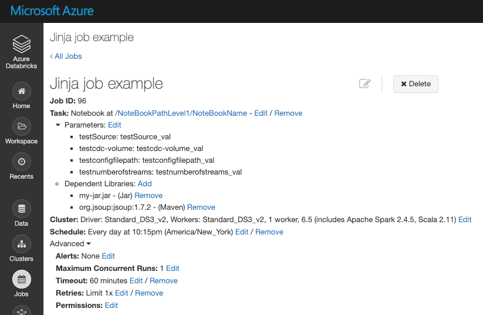

# db-dsc-jobs
This code is intended to alleviate manual effort required to manage jobs in a Databricks workspace.  The functionality has been designed with specific criteria and the code provided does not currently cover all potential scenarios.

There are two primary functions to this application; authenticate to a Databricks workspace, and then query, delete, and submit jobs in that workspace.  Both authentication and job management are read in from JSON files which need to be created or modified prior to executing to application.

Usage:

``` 
python job.py --params params.json
```

The Databricks job definition is based on templates from the jinja2 library.  The application will read in each file in the `/jobs/` folder and apply the attributes using the appropriate jinja2 template. Both files and folders need to be present for the application to function correctly.

## Application Functionality

The application performs the following operations:

1. Read in parameter file
2. Acquire authentication token
3. Query for existing jobs in the cluster
4. Generates list of target jobs to delete and resubmit based on `creator_user_name`
5. Read in all JSON job definition files from `\jobs\` directory
6. Delete only jobs which have a name matching a definition in the `\jobs` directory
7. Create jobs based on defintions in the `\jobs` directory

Jinja2 library information can be found here:  
https://pypi.org/project/Jinja2/


## Environment Requirements

The following requirements need to be met in your Azure and Databricks environment before this application will work correctly:

Regardless of authentication approach, the user being authenticated with for this application needs to be added to the Databricks instance.  
Documentation can be found here: https://docs.databricks.com/dev-tools/api/latest/scim/index.html

The following cURL command is an example of adding a service principal or a managed identity to a cluster.

```
curl -n -X POST \
-H 'Content-Type: application/json' \
-H 'application/scim+json' \
-H 'Authorization: Bearer <personal access token or generated Bearer token>' \
-d '{ 
  "schemas":[
    "urn:ietf:params:scim:schemas:core:2.0:ServicePrincipal"
  ],
  "applicationId":"00000000-0000-0000-0000-000000000000",
  "displayName":"test-msi-or-spn",
  "groups":[
    {
       "value":"my-group"
    }
  ],
  "entitlements":[
    {
       "value":"allow-cluster-create"
    },
        {
       "value":"can-manage"
    }
  ]
}' \
https://adb-0000000000000000.0.azuredatabricks.net/api/2.0/preview/scim/v2/ServicePrincipals
```

To confirm that the user was added, call the SCIM API to list service principals:

```
curl -n -X GET -H 'Content-Type: application/json' \
-H 'application/scim+json' \
-H 'Authorization: Bearer <personal access token or generated Bearer token>' \
https://adb-0000000000000000.0.azuredatabricks.net/api/2.0/preview/scim/v2/ServicePrincipals
```

## Job Template Values

The JSON job templates provided in the `\jobs\` folder contains base values required for job execution along with parameter values which can be passed to the job. The parameters are defined using key:value pairs and correlate with the Jinja2 template.

### Job definition file

```
  {
    "name": "Jinja job example",
    "workers": 1,
    "notebookpath": "/NoteBookPathLevel1/NoteBookName",

    "par_sourcesystem": "testSource",
    "par_sourcesystem_val": "testSource_val",

    "par_cdc_volume": "testcdc-volume",
    "par_cdc_volume_val": "testcdc-volume_val",

    "par_numberofstreams": "testnumberofstreams",
    "par_numberofstreams_val": "testnumberofstreams_val",

    "par_configfilepath": "testconfigfilepath",
    "par_configfilepath_val": "testconfigfilepath_val",

    "description": "Not used in template, for reference"
  }
```

### Jinja2 template snippet

```
  ...
    "notebook_task": {
      "notebook_path": "{{ job.notebookpath}}",
      "base_parameters": {
        "{{ job.par_sourcesystem }}": "{{ job.par_sourcesystem_val }}",
        "{{ job.par_cdc_volume }}": "{{ job.par_cdc_volume_val }}",
        "{{ job.par_numberofstreams }}": "{{ job.par_numberofstreams_val }}",
        "{{ job.par_configfilepath }}": "{{ job.par_configfilepath_val }}"
      }
  ...
```
### Databricks job definition

After the job has been created, the parameters mapped can be seen in the job definition within Databricks.




## Authentication Parameter File

The parameter file will have the following values present, depending on which authentication method is used.

|Attribute |Value |
|----------|----------------|
|`authority_type`|Designates the method of authenication (`spn-cert`, `spn-key`, `msi`, `pat`)|
|`authority`|Endpoint for the authentication process |
|`client_id`|Application (Client) ID or Email/UPN|
|`resource`|Static value for the Databricks resource provider (`2ff814a6-3304-4ab8-85cb-cd0e6f879c1d`)|
|`databricks_uri`|Databricks base URI|
|`cert_thumbprint`|When using a certificate, the thumbprint value from the file|
|`private_key_file`|When using a certificate, local location of the private key file|
|`client_secret`|When using Key authentication for a service principal, this is the secret generated from AAD|
|`pat_token`|Personal Access Token generated from Databricks|


### Authority Type Details

|Authority Type | authority_type value | Client ID | client_id value |
|---------------|----------------------|-----------|---------|
|Service Principal using Certificate | `spn-cert`|Application (client) ID from AAD|`00000000-0000-0000-0000-000000000000`|
|Service Principal using Key | `spn-key` |Application (client) ID from AAD|`00000000-0000-0000-0000-000000000000`|
|Managed Service Identity | `msi` |Client ID from resource|`00000000-0000-0000-0000-000000000000`|
|Personal Access Token | `pat` |Email/UPN|`user@domain.com`|

For Service Principal authentication, allowed methods are using a certificate associated with the identity or a generated key.  In order to acquire the authentication token required to communicate with Databricks REST APIs, a scope specific to the Databricks resource provider in Azure must be specified.  That attribute from the parameter file is `resource`, which is then appended with `/.default` for the authenitcation token generation API call.  The MSAL required library facilitates this API call.

During the testing of this application, a locally generated certificate was generated using this method: https://github.com/AzureAD/microsoft-authentication-library-for-python/wiki/Client-Credentials

Managed Identity (or Managed Service Identity, MSI) is a specific resource either created indepently in Azure (user-generated) or is created and associated to a resource when it is created in Azure (system-managed). MSIs do not use the MSAL library but instead call a known endpoint from the resource it's associated to in Azure.  In our testing, we created a managed identity and then associated it to a VM.  We are only able to successfully generate a token when calling the known endpoint from within that VM.  The resource scope is also a necessary part of that API call and is specific to Databricks.

Personal Access Tokens allow for authenicating directly against the Databricks instance, since the token is generated from the service.

### Authentication Examples

```
{
    "authority_type": "spn-cert"
    "authority": "https://login.microsoftonline.com/<tenant_id>"
    "client_id": "<client-id>"

    "resource": "2ff814a6-3304-4ab8-85cb-cd0e6f879c1d"
    "databricks_uri": "https://<adb_instance>.azuredatabricks.net",

    "cert_thumbprint": "<cert_thumbprint>",
    "private_key_file": "<private_key_file.ext>"
}
```

``` 
{
    "authority_type": "spn-key"
    "authority": "https://login.microsoftonline.com/<tenant_id>"
    "client_id": "<your-sp-client-id>"

    "resource": "2ff814a6-3304-4ab8-85cb-cd0e6f879c1d"
    "databricks_uri": "https://<adb_instance>.azuredatabricks.net",

    "client_secret": "<client_secret>"
}
```

```
{
    "authority_type": "msi"
    "authority": "http://169.254.169.254/metadata/identity/oauth2/token?api-version=2018-02-01"
    "client_id": "<client-id>"

    "resource": "2ff814a6-3304-4ab8-85cb-cd0e6f879c1d",
    "databricks_uri": "https://<adb_instance>.azuredatabricks.net"
}
```

```
{
    "authority_type": "pat"
    "client_id": "<client-id>"

    "databricks_uri": "https://<adb_instance>.azuredatabricks.net"

    "pat_token": "<pat_token>"
}
```

## Additional Resources

For testing purposes, the following cURL call be used to generate a token using values required in the parameter file.  This example uses a service principal authenicating using a key:

```
curl -X GET 
-H 'Content-Type: application/x-www-form-urlencoded' \
-d 'grant_type=client_credentials&client_id=<client_id>0&resource=2ff814a6-3304-4ab8-85cb-cd0e6f879c1d&client_secret=<client_secret>' \
https://login.microsoftonline.com/<tenant_id>/oauth2/token
```

## Contributing

This project welcomes contributions and suggestions. Most contributions require you to agree to a Contributor License Agreement (CLA) declaring that you have the right to, and actually do, grant us the rights to use your contribution. For details, visit https://cla.opensource.microsoft.com.

When you submit a pull request, a CLA bot will automatically determine whether you need to provide a CLA and decorate the PR appropriately (e.g., status check, comment). Simply follow the instructions provided by the bot. You will only need to do this once across all repos using our CLA.

This project has adopted the Microsoft Open Source Code of Conduct. For more information see the Code of Conduct FAQ or contact opencode@microsoft.com with any additional questions or comments.
